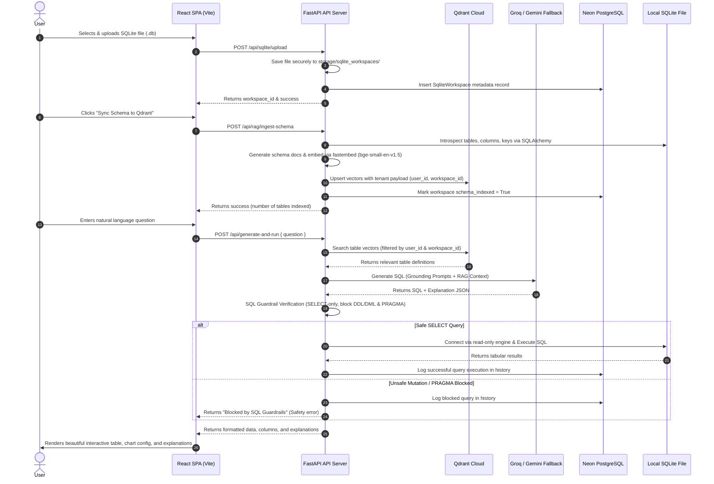

# QueryGen AI — System Architecture

This document describes the full-stack system architecture of **QueryGen AI**, a schema-aware, RAG-powered natural language to SQLite SQL generation agent.

## System Workflow Diagram

The diagram below details the end-to-end flow from database file upload and schema indexing to safe natural language query execution:

## Modular Architectural Components

### 1. SQLite Workspace Storage & Introspection (`backend/app/api/sqlite.py` & `backend/app/db/schema_introspect.py`)
- Manages uploaded SQLite database files, storing them securely on disk under paths isolated by user ID and workspace ID.
- Accesses SQLite files in read-only mode (`mode=ro`).
- Uses SQLAlchemy inspector to fetch table names, column details, data types, nullability, primary keys, and foreign-key constraints.

### 2. Qdrant Cloud Semantic RAG Retriever (`backend/app/rag/`)
- Serializes database schema tables into structured markdown documents.
- Uses `fastembed` (`BAAI/bge-small-en-v1.5`) to generate high-dimensional indices.
- Performs cosine-similarity matching of user questions against table embeddings in Qdrant Cloud.
- Enforces multi-tenant isolation by filtering Qdrant queries on `user_id` and `workspace_id` payloads.

### 3. Prompt Engineering & LLM Client (`backend/app/llm/`)
- Integrates with Groq (primary) and Gemini (fallback) API endpoints.
- Structures system instructions to guide models to output standard SQLite statements.
- Configures deterministic structured JSON outputs (`LLMResponse`) matching expected Pydantic schemas.

### 4. Strict Backend SQL Guardrails (`backend/app/sql/`)
- Runs a multi-tier regex and lexical analyzer to validate queries.
- Blocks write mutations (DML/DDL), semicolon injections, comment hacks, and SQLite-specific administrative commands (`PRAGMA`, `ATTACH`, `DETACH`, `VACUUM`, etc.).
- Restricts queries referencing internal platform tables (`querygen_users`, `querygen_history`, etc.).
- Enforces query limitations (`LIMIT 50`) and hard caps result lists to prevent Denial of Service.

### 5. Platform Metadata Database (`backend/app/db/connection.py` & `models.py`)
- Neon PostgreSQL database used for platform services.
- Stores user credentials, session settings, SQLite workspace records (file metadata, indexing timestamps), and user query execution logs.
