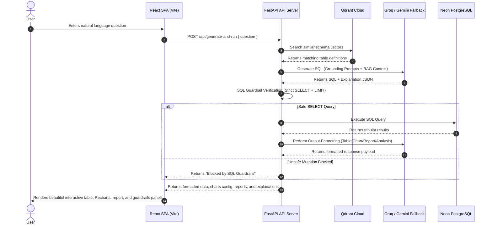

# QueryGen AI — System Architecture

This document describes the high-performance full-stack system architecture of **QueryGen AI**, a schema-aware, RAG-powered natural language to SQL generation agent.

## System Workflow Diagram

## Modular Architectural Components

### 1. Database & Schema Introspection (`backend/app/db/`)
- Connects securely to Neon PostgreSQL (via SQLAlchemy engines and connection pools).
- Enforces strict read-only execution modes and limits statement execution timeout.
- Uses database inspectors to fetch exact live schemas including column data types, nullability, primary keys, and foreign-key constraints.

### 2. Qdrant Cloud Semantic RAG Retriever (`backend/app/rag/`)
- Serializes database schema tables into structured markdown documents.
- Uses state-of-the-art vector embeddings (`BAAI/bge-small-en-v1.5` via fastembed) to generate high-dimensional indices.
- Performs cosine-similarity matching of user questions against table embeddings in Qdrant Cloud to dynamically load only relevant schema context.

### 3. Prompt Engineering & LLM Client (`backend/app/llm/`)
- Supports Groq (primary) and Gemini (fallback) API endpoints.
- Configures deterministic structured JSON outputs (`LLMResponse`) matching expected Pydantic schemas.
- Grounds SQL generation inside the exact retrieved database metadata, completely eliminating hallucinations.

### 4. Strict Backend SQL Guardrails (`backend/app/sql/`)
- Operates a rigorous multi-tier regex and lexical analyzer.
- Denies write mutations, administrative operations, comment injections, and multi-statement queries.
- Automatically inserts limits (`LIMIT 50`) and caps results at `MAX_ROWS=100` to prevent slow operations.

### 5. Format-Aware Execution & Analysis (`backend/app/services/`)
- Integrates generation and execution services.
- Detects user formatting intent from natural language questions (e.g., table, bar chart, pie chart, report, analysis).
- Automatically parses execution rows to identify category and numeric value keys for Recharts.
- Generates rich markdown reports and analytical insight metrics dynamically using LLMs.
